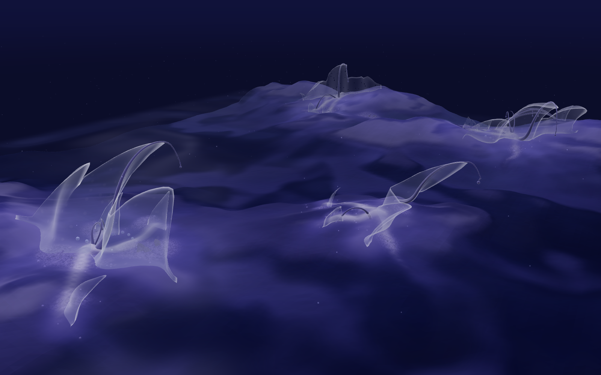

# Residual Ecology

*Procedural World Building — weekly study notebook.*

A dreamlike living ecology where terrain, organisms and collective behaviours
leave traces that reshape the world for what comes next. The working question
across all of it:

> **How can a procedural world reveal its own history through the traces its
> systems leave behind?**

Each week is one experiment, documented as it went — what was asked, what was
built, what actually happened, and what broke. The studies build on each other:
a height field, then something moving across it, then the same ground given an
inside.

The app lives in [`react-app/`](react-app/) (React + Vite + three.js) and is
deployed at **residual-ecology.web.app**.

---

## Studies

| | Study | What it explores |
|---|---|---|
| 01 | [Noise / height field](docs/01-noise-study.md) | Sampling a continuous function into a field; layering, shaping, and showing the same numbers as both a 2D map and a displaced 3D grid |
| 02 | [Sediment simulation](docs/02-sediment-simulation.md) | A second, moving field running over the static terrain — supply, transport, deposition |
| 03 | [Voxel / volume study](docs/03-voxel-study.md) | Density fields, two meshing techniques, and the search for a grown rather than eroded morphology |
| 04 | [Shader study](docs/04-shader-study.md) | Three material readings of the same terrain — geological, dormant, membrane |
| 05 | [Scatter study](docs/05-scatter-study.md) | Populating the world with three trace-grown languages — bridgework, membrane bloom, shard / residue — placed by rules over the world's data and its sediment history |
| 06 | [Water veins — spline study](docs/06-passages-study.md) | Assignment 2: streams traced downhill from high ground into the basins, carving their channels into the one world every tab shares. *Paused; needs later revision* |
| 07 | [Air — particle study](docs/07-air-study.md) | Assignment 3: a small ecology of air residents — dust, wisps, motes, flakes, haze — moved by one field with quiet pockets, downhill streams and a circulation at each colony. *Pre-rework baseline; phased rework next* |

## Direction and constraints

- [**Project direction**](PROJECT_DIRECTION.md) — the concept, the vocabulary
  it carries forward, and where the whole thing is heading
- [**Aesthetic language**](AESTHETIC_LANGUAGE.md) — the visual and experiential
  rules every weekly experiment is held to

## Reference and setup

- [Visual references](docs/references/) — direction-setting images for the
  volume study
- [Tutorials](docs/tutorials/) — [Firebase setup](docs/tutorials/firebase.md)
  for this repo, plus Git and React notes
- [Backlog](backlog.md) — early course planning

---

## Where it has got to

*Study 03 — the sediment bed given thickness. One density value per point in a
box, meshed into a surface.*

*Study 03 — the same system pushed toward rupture. A continuous ridge behind, a
scree of plates in front.*

*Study 05 — the same world populated by a colony. Every form is placed by rules
over the ground, the water and a recorded sediment history.*

> **Captures still needed:** studies 01, 02 and 04 have no screenshots yet — see
> the note at the top of each of those documents for exactly what to grab.
