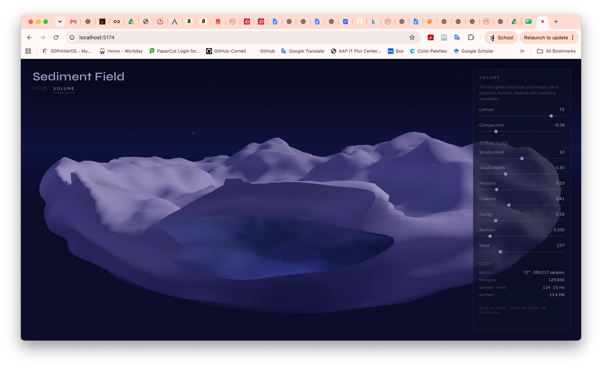
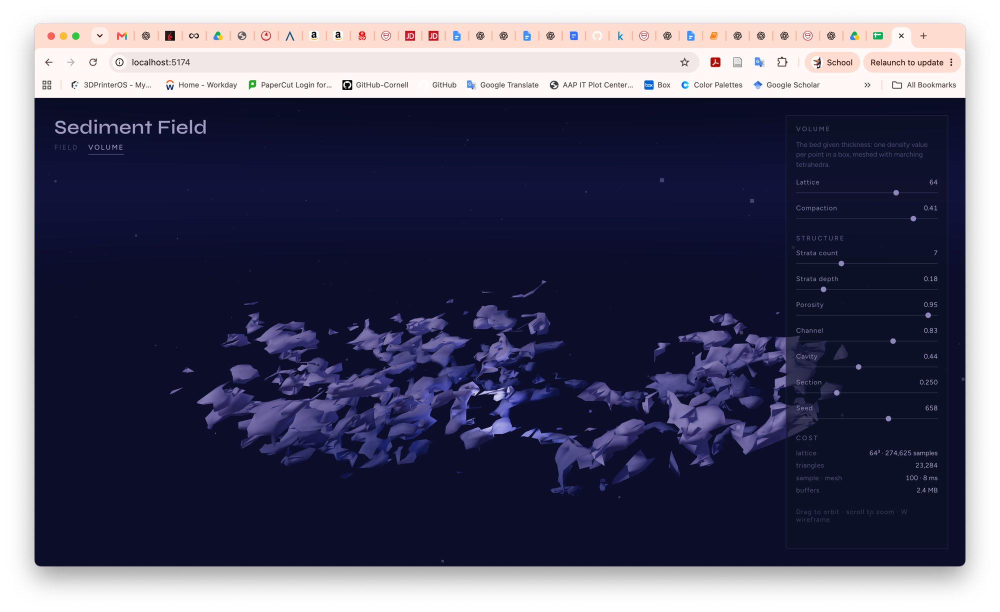
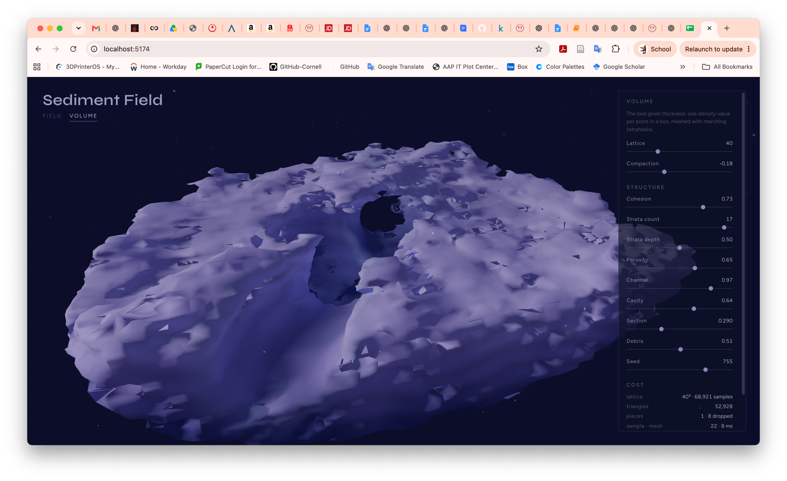

# 03 · Voxel study

*Week 3 onward. Trying out a volumetric representation — not building a voxel
engine.*

**The assignment.** Build a voxel / density field, pick one meshing technique,
and evaluate whether the representation fits the project. Later weeks added a
second mesher for comparison and pushed the morphology toward the project's own
direction.

## Question

**How can sediment become volumetric rather than only topographic?**

Weeks 1–2 store one height per `(x, z)`. That gives slopes and shorelines but
cannot express thickness, a layer sequence, a cavity, or a channel running
*through* material. So: give the bed an inside.

## Current approach

**Density field** — one scalar per point in a 10 × 5.2 × 10 box, positive
inside the mass. The top surface comes from the *same* noise stack the terrain
view uses, so this is the week-1 field seen from the side with material
underneath.

**Sequential operations** (`src/lib/density.js`) — the density is one value
passed through a short list:

1. bed — solid below the noise surface
2. floor — close the bottom
3. fragment — intersect an ellipsoid, so it's a piece of bed not a block
4. strata — a small vertical ripple (the deposition layers)
5. pores — subtract 3D noise lobes
6. channel — subtract a meandering tube
7. cavity — subtract a chamber
8. **scaffold — add a generated network back through the voids** (see below)
9. section — subtract a half-space so the inside can be seen

Everything stays in signed-distance terms, so the operations compose with `min`
— except step 6, which is the only one that adds.

**Meshing** — marching tetrahedra. Same family as marching cubes, but each cube
is split into six tetrahedra first: 16 unambiguous cases instead of 256 with
ambiguous ones, so the case table fits on a screen. Costs about double the
triangles. Normals come from the density gradient, which is what makes it look
sculptural rather than faceted.

**Main controls** — Lattice, Compaction (isolevel), Cohesion, Strata count and
depth, Porosity, Channel, Cavity, Section, Debris, Seed.

## What I observed

**Cohesive mass works well.** Low porosity gives a single body with real
thickness and a readable open interior.

*Compaction −0.38, porosity 0.19 — one connected piece, 130k triangles.*

**Excessive porosity creates disconnected debris.** Past about 0.6 porosity with
positive compaction, the mass dissolved: 245 separate pieces, the largest
holding only 3% of the material. Reads as ash, not sediment — there is no body
for the fragments to have come from.

*Porosity 0.95, compaction +0.41 — 245 pieces, and fewer triangles at a higher
lattice, which is the tell that the material evaporated.*

**Some fractured states are visually interesting.** A smooth ridge behind, a
scree of angular plates in front. Checking it with a flood fill was the useful
surprise: this is **one connected component holding 100% of the material** — the
shattered look comes from thin plates joined by thin necks, not from actual
disconnection.

*Porosity 0.82, compaction −0.44.*

So there are two different things hiding behind "too fragmented": visually
fractured but continuous (good), and actually disconnected into dust (bad). The
difference is whether a parent mass survives.

**Continuity improved after adding cohesion / debris filtering.**

- **Cohesion** eases the pore cut back toward solid with depth — voids bite the
  rind, the core stays continuous.
- **Debris** flood-fills the solid samples and drops pieces below a size
  threshold before meshing.

On the dissolved state: 245 pieces → 23, largest piece 3% → 57% of the
material. The good states were unchanged. Porosity can now be pushed to ~0.9
and still keep one dominant body, where before anything past 0.6 destroyed it.

*Cohesion 0.73, porosity 0.65 — one piece, 8 dropped. Fractured rind over a
continuous core.*

**One bug found:** a dark sphere appeared inside the volume. It was the cavity
operation — correct density behaviour, but the material was double-sided, so
from inside the mass the cavity wall rendered as a convex ball instead of
reading as a hole. Fixed by using front faces only; the mesh is watertight and
correctly wound, so nothing else changed.

## Performance / chunking

Voxel cost grows **cubically** — doubling the lattice is 8× the work. Sampling
dominates (~70%), not meshing.

| lattice | sample + mesh | triangles (tetrahedra) |
|---|---|---|
| 32³ | 16 + 19 ms | 28k |
| 48³ | 43 + 20 ms | 78k |
| 64³ | 96 + 33 ms | 156k |
| 80³ | 169 + 64 ms | 262k |

48³ is the default: fast enough to stay interactive, detailed enough for pores
and strata to read. Also, only ~12% of samples are inside the mass, so most of
that work is spent on air.

**Chunking** would matter in a bigger version: rebuild only the chunks an edit
touches instead of the whole array, cull and LOD by distance, and run chunks in
parallel workers. Not needed at this size, but the code is shaped for it —
`buildVolume` and the meshers take a field/array plus a resolution and know
nothing about the scene.

## Meshing comparison

Both meshers read the **same density samples, same parameters, same isolevel** —
only the interpretation differs. Switchable in the panel.

**Marching tetrahedra** places vertices on lattice edges and builds triangles
inside each cell. Unindexed triangle soup, so every triangle carries three
unique vertices.

**Surface nets** places **one vertex per cell** at the average of that cell's
edge crossings, then builds a quad across every lattice edge that changes sign.
Vertices are shared, so the mesh comes out indexed.

Same field, default shape:

| lattice | tetrahedra (verts / tris / MB) | surface nets (verts / tris / MB) |
|---|---|---|
| 32³ | 85k / 28k / 2.9 | 4.9k / 11k / 0.3 |
| 48³ | 234k / 78k / 8.0 | 13k / 29k / 0.8 |
| 64³ | 469k / 156k / 16.1 | 26k / 57k / 1.6 |
| 80³ | 785k / 262k / 26.9 | 44k / 93k / 2.6 |

At 48³ surface nets uses **17.6× fewer vertices, 2.7× fewer triangles, 10× less
memory**, and meshes slightly faster. On a sphere of known radius both land the
same vertex accuracy; surface nets encloses 99.3% of the true volume vs 99.7%,
because averaging one point per cell shrink-wraps slightly.

**Visual character** — tetrahedra follows every crossing exactly, so it keeps
the thin plates and sharp fracture detail; that is where its organic broken
quality comes from. Surface nets gives larger, more even patches and a softer,
more membrane-like surface; thin features get rounded off or dropped, and
cavities read more cleanly because there are fewer slivers around their mouths.

**What each seems better for** — tetrahedra for the fractured, papery states
where the detail *is* the subject; surface nets for the cohesive masses, and for
anything that needs to be cheap. No winner yet; they suit different states of
the same field.

## Residual Vein / Scar Layer

**Why.** Every operation except `strata` was subtractive — the field could only
ever take material away, so the volume could express fragmentation and nothing
else. Of the project's four verbs (Accumulation, Return, Fragmentation, Growth)
it could only do one. This adds the first operation that puts material *back*.

**How it changes the pipeline.** A ridged noise field (`1 − |fbm3|`, domain
warped) thresholded near its maximum selects a thin branching sheet. Along that
sheet, density is **added** — placed after porosity so the vein survives the
erosion around it, and before channel/cavity/section so those still cut it open.
It is faded out near the skin of the mass, so it can never bulge the outside and
is only ever seen where something has opened the sediment down to it.

Two things turned out to matter, both found by measuring rather than looking:

- **Add, don't union.** `max(d, solid)` flips a voxel solid whenever it touches
  a filament *regardless of strength* — the isolevel only sees the sign — which
  made the strength control a no-op. Adding density instead means strength
  decides how much erosion a vein can survive.
- **Sheets, not filaments.** The first version intersected two ridged fields to
  get 1D strands. But a section plane cuts a strand as a *dot* and a sheet as a
  *line*: vein coverage on the section face went from 1.6% to 5.2% by dropping
  to a single sheet. It is also the better reference — a mineral vein is a
  filled fracture, which is planar.

**Conceptually.** A line the material kept returning to: reinforced, denser than
the sediment holding it, older than the erosion around it. Ambiguous on purpose
between mineral vein, scar, and root — geological enough not to read as anatomy.

**Controls.** `Vein` (strength, 0 = off), `Vein width`, `Vein drift` (how much
the sheet meanders). Cost is +12–21% sampling, because the operation is only
evaluated inside the mass.

**Observation.** It does shift the register. The mass stops reading as purely
eroded rock, because the section face now shows something that *resisted* — pale
bands running through the layering rather than with it. It is still subtle at
the default (~3% of the visible surface), which feels about right for an early
experiment; the risk with turning it up is that it starts looking like marbling
rather than like history.

## Refinement pass — toward a grown substrate

The volume was reading as *eroded and crumbled* rather than *grown*. Three
things were wrong: the mass was peppered with micro-holes, the vein read as
scattered light spots rather than structure, and a perfect sphere kept appearing
in the interior.

**What the peppering actually was.** Measured rather than guessed: a flood fill
over the *void* found **73 sealed pockets inside the mass, 46 of them a single
cell**. Bubbles too small to read as interior space, each one producing a closed
surface or a pinhole where it grazed the skin. A useful metric fell out of it —
**skin per unit of material**, since a mass riddled with tiny breakthroughs has
far more surface per unit of volume than a cohesive one.

**How continuity improved.** Three changes, in order of effect:

- **Fill small pockets.** The exact mirror of the existing debris filter, using
  the same threshold, because a one-cell shard and a one-cell bubble are equally
  illegible. A void touching the lattice edge is open air and is never filled,
  so large chambers survive.
- **Consolidation** (new control). One 6-neighbour blend of the lattice before
  meshing. Pinholes and slivers do not survive it; anything larger barely moves.
- **Larger, smoother pores.** Pore noise dropped from three octaves to two and
  its scale widened — the third octave was small enough to punch pinholes
  through the rind, which is what made the surface look crumbled.

Together, at the new defaults: **skin/volume 4.58 → 2.82 (38% less skin per unit
of material)**, loose fragments needing removal 19 → 5, and ~40 pockets filled
per build. Still one connected piece, still visibly ruptured.

**How the vein was reinterpreted.** It was a small, high-frequency sheet, so
where it met the surface it left isolated patches — light spots, not structure.
Now it is broader (larger scale, two octaves instead of three) and **compressed
vertically**, so the sheets lie with the bedding and read as seams running
through the layering. The colour band was tightened as well, so only the seam
itself lightens rather than a soft blob around it.

**The sphere.** Not a debug object and not a meshing artifact — it was the
cavity operation working exactly as written. A subtracted sphere, seen through
the section or from inside the mass, reads as a ball rather than as space. The
fix is that a mathematically perfect sphere was the one shape in here that
looked *placed* rather than grown, so its radius is now pushed around by noise:
boundary radius now varies ±74% by direction instead of being constant.
Compaction was also narrowed from ±0.6 to ±0.45, since the far ends of the old
range were where the interior broke up in unstable ways.

**Which mesher looks more promising.** **Surface nets**, clearly, for this
direction. Softer, more continuous patches suit a grown substrate, and it is an
order of magnitude cheaper — at the new defaults 9.6k vertices against 170k, and
81 ms against 153 ms for the whole rebuild. Its shrink-wrapping also *helps*
here, rounding off exactly the thin features this pass is trying to remove.
Marching tetrahedra stays available and is still the better tool when the sharp
fracture detail is the subject. It is now the non-default.

Note: the pore change means the three reference states above no longer reproduce
their old triangle counts exactly (they shift 1–13%). Their character is
unchanged — A and C are still single-piece, B is still the dissolved one.

## Residual scaffold — replacing the vein

The refinement pass cleaned the sponge up but did not change what it was. The
diagnosis, written down before rebuilding anything:

**The generator was structurally incapable of the target morphology.** It starts
from a filled volume and everything interesting is subtraction of isotropic
noise — which is the definition of a sponge. Isotropic noise has no direction,
one frequency means one feature size, and, decisively, **subtraction cannot
invent a connection**. A strut, a bridge, a rib are all statements that *two
places should be joined*, and there was no term in the field that could express
that. The vein was the right instinct with the wrong primitive: a thresholded
ridged sheet is "wherever this noise crosses zero", not a path that goes
somewhere, which is why it read as scattered patches.

The target morphology came from four direction images in
[`docs/references/`](references/) — `vox-ref1`–`vox-ref4`. They are conceptual
mockups, not app output: elongated continuity, larger openings connected by
bridges, and an internal seam network spanning a chamber.

**What replaced it.** An explicit network, built as a graph and queried as a
distance field (`src/lib/scaffold.js`):

1. nodes scattered on a jittered lattice, trimmed to an ellipsoid
2. joined by a **minimum spanning tree** — so the structure is connected by
   construction, not by luck
3. the shortest leftover edges added back, which is what closes the loops that
   bound openings
4. each edge bowed along a noise offset and cut into segments
5. radius tapered — thick at nodes, thin mid-span

Then one operation: the distance to that network hollows the substrate back
from it (*clearance*) and unions the strut into the gap that leaves. The
structure both grows and displaces what it grew through.

**The ordering turned out to be the whole thing.** First attempt put the
scaffold where the vein was, before the channel and cavity — and those voids
simply deleted it. Struts only span open space if the space is carved *first*.
Moving it to step 8, after every void and before the section, took the visible
strut surface from 5% to 18% and is the difference between a network buried in
rock and a network crossing a chamber.

**Cost.** Distance to ~160 segments per voxel would be hopeless, so segments are
binned into a uniform grid: **3.9 segments tested per voxel** on average, and
sampling is unchanged at ~50 ms. Building the graph is under a millisecond. This
is the same argument that makes chunking matter — an acceleration structure
turning an intractable query into a free one.

**Controls.** `Scaffold` (strut thickness, 0 = off), `Scaffold nodes` (fewer
means longer spans), `Scaffold loops` (0 is a pure tree, higher closes cycles),
`Clearance` (how far the sediment is pushed back — this is the dial between the
scaffold sitting flush inside the mass and standing clear to bridge an opening),
`Scaffold bow`.

**Observation.** It does what the sponge could not: material now crosses space
instead of merely surrounding it, and because the tree guarantees connectivity
there are no isolated blobs to clean up afterwards. Across four seeds the mass
stays a single piece with 14–18% of the visible surface being strut. Note that
`skin/volume` stops being a fragmentation metric once struts exist — a network
legitimately has a lot of surface per unit of material.

## Next

Keep looking for the balance between a continuous sediment mass, local voids and
porosity, readable thickness, and *controlled* fragmentation — fragmentation as
a deliberate amount rather than a side-effect of two sliders interacting.
Cohesion and debris got part of the way there; what is still missing is any
sense of minimum wall thickness, which is the real cause of the papery look at
high porosity.
