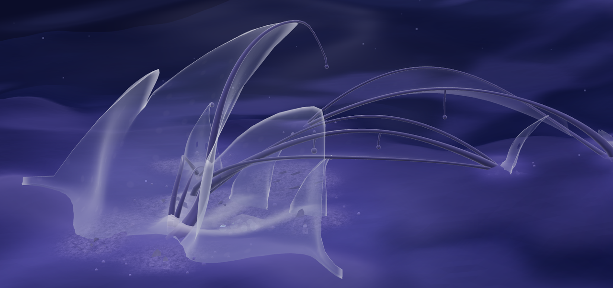
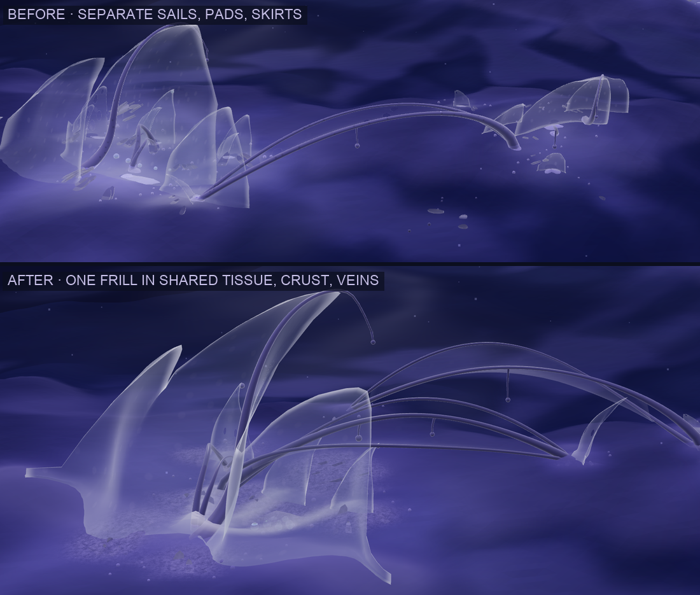
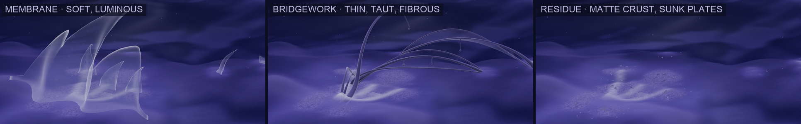
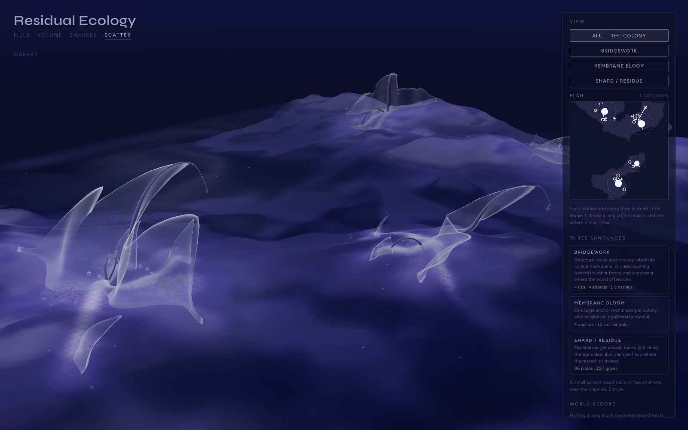
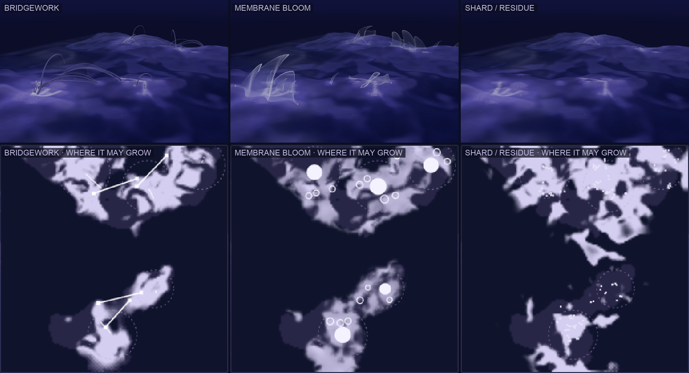
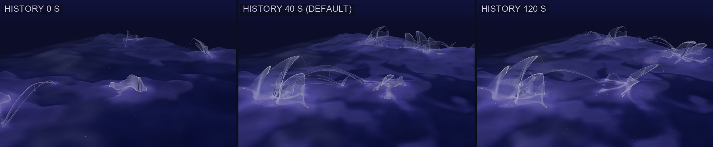
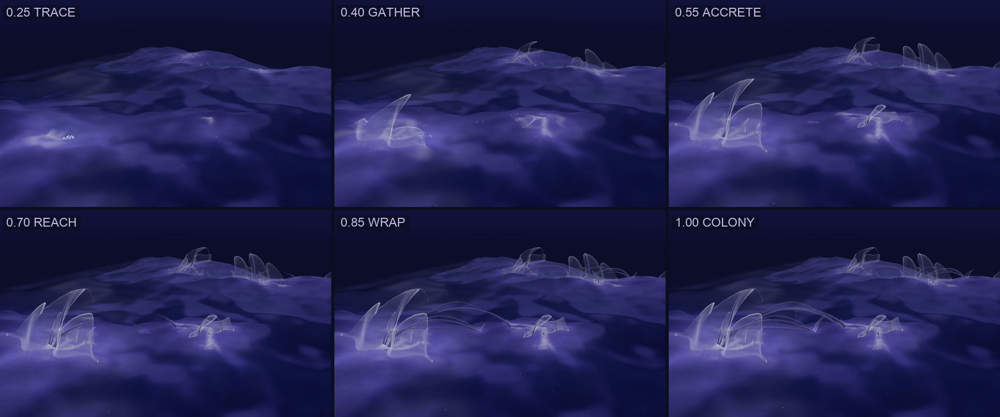
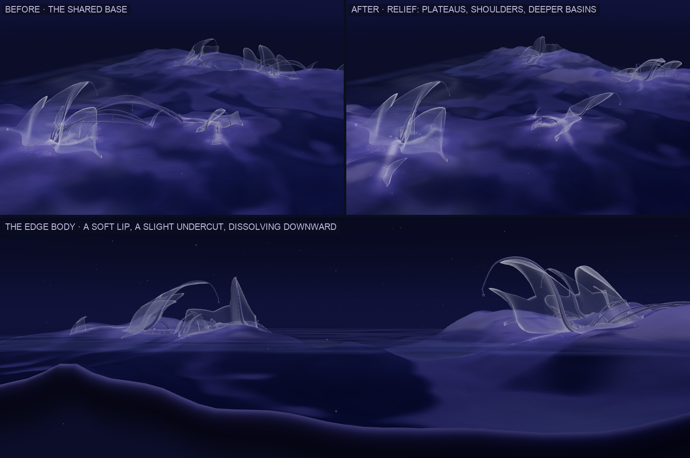
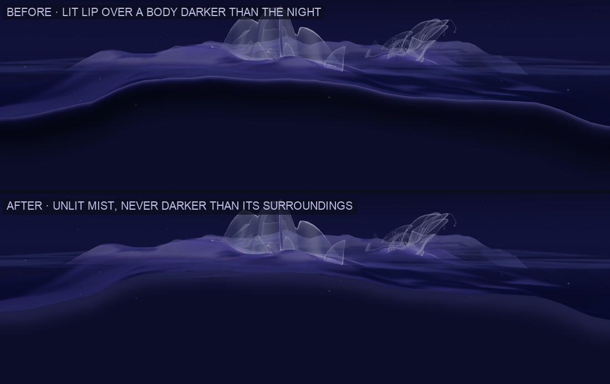

# 05 · Scatter study

*Week 5. Populating the world with forms the world has earned.*

**The assignment.** Develop a scattering system that populates the environment
with different assets. Give each type its own layer and controls, define
protocols for where they appear (avoid cliffs? near water? cluster in zones?
respond to field values?), and vary them with world data.

*Five colonies on the default landform. Nothing here was placed by hand, and
nothing was placed at random either.*

## Question

If the world is one organism, where would it grow its structures? Can that be
read off the world's own data — its ground, its water, its history — rather
than painted on?

## From scattering to colonies

The first passes scattered each language on its own over all suitable
ground. Every rule held, and it still read as props: many similar forms,
evenly spread, each standing alone on the terrain. Fragmented, flat, a little
game-like.

The system now forms **colonies**. It finds a few strong places in the world
and grows each one with a hierarchy, leaving the ground between them empty.

1. **Site potential.** One field from the existing data: dry ground near the
   water, gentle, holding some record, inside the colony field, sheltered
   rather than exposed.
2. **Sites.** The strongest peaks of that field (blurred, so a colony starts
   somewhere broad), at least 6.5 units apart, at most five. Each colony gets
   a **maturity**, mostly from the record around it, and a direction: toward
   the water, turned 20–40° along the shore.
3. **Growth in order**, inside each colony:
   - one **anchor** membrane at the site
   - smaller veils on suitable ground nearby
   - **structure** joining them
   - **residue** caught around them and laid along their trace

Each language's per-point rules are unchanged; they now decide where *inside*
a colony a member may stand. Nothing grows outside a colony.

## Scale hierarchy

Hierarchy is built in, not tuned:

- The **anchor** is roughly 2–4 units tall, sized by the colony's
  maturity: one continuous frill with two or three crests of different
  heights, so it is a larger gesture rather than one sail scaled up.
- Every **smaller veil** is a fraction of its anchor: about half beside it,
  falling to a fifth at the colony's edge.
- **Structure** is thin by comparison: ribs, strands, at most one crossing.
- **Residue** is smaller again: plates of 0.1–0.5 units and grains.

The anchor is also a fuller skin; lace belongs to the smaller veils further
from the water.

## Continuity: one body, not related pieces

**What remained.** The colony version fixed the scattering, but each colony
still read as several related pieces grouped together:
- the anchor was a row of separate sails, each on its own pad and skirt
- strands ended in their own footings
- residue lay as separate plates, glass like everything else
- one material made every language read as the same glass shell

**What changed in this pass:**

- **Colony structure: one frill.** A bloom is now a single continuous
  membrane rising from a meandering base line and differentiating into one to
  three crests. Between crests it falls to a web at about a third of their
  height:
  - higher, and it read as a flat-topped curtain
  - lower, and it fell apart into separate fins

  Toward its ends it tapers down into the ground. Ribs run up its tallest
  crests, so structure and membrane are one gesture.
- **Terrain integration: shared tissue.** Each colony grows one continuous
  skin over the ground. It is generated as a field from everything the colony
  placed, and it replaces all pads and skirts:
  - it mounds up along every frill's base line and every strand footing
  - it carries raised **veins** from the anchor to each other member and down
    the residue trail, with a slow light moving along them
  - a thin shared body fills the gaps between members, fading at the
    colony's edge
  - it turns into granular **crust** wherever residue settled

  Frills peel out of it, strands root into it, and plates sink into it.
- **Residue as field.** Most of what a base catches is now fine material,
  shown as crust in the tissue. Plates are fewer, buried deeper, and the heap
  sits inside the colony rather than beside it.
- **Material language.** Four materials instead of one glass:

  | Material | Language | Look |
  |---|---|---|
  | membrane | Membrane Bloom | the softest and most luminous: cool blue-white, light held inside, light pores |
  | tension | Bridgework | darker, fine fibres along the strand, one crisp line of highlight |
  | sediment | Shard / Residue | matte, granular, opaque, tinted toward the record |
  | tissue | the colony | milky ground skin with veins and crust |
- **Growth.** The tissue spreads out from the anchor, veins first, with a faint
  light at its growing edge. Then each frill unfurls sideways out of it, its
  tallest crest first, every column rising from its own foot.

## Three languages

| | Role in a colony | Reads | Controls |
|---|---|---|---|
| **Bridgework** structural support | **Ribs** up the anchor membrane, carrying on past its lip. **Strands** from the anchor toward the larger veils, some stopping short in the air. One **crossing** where a hollow or water lies within reach, with a small membrane where it lands | depth, slope, the ground *between* two footings | Amount (how much structure) · Reach |
| **Membrane Bloom** soft surface / growth | The **anchor** frill and **smaller frills**: continuous sheets whose crests climb off-centre and hook toward the water | shore distance, slope, trace, hollow | Amount (how many smaller frills) · Openness |
| **Shard / Residue** sediment / fragment | Material **caught around bases**, a **trail** laid down the gradient from the anchor, one **heap** at the colony's thickest record — mostly as crust in the tissue, with plates sunk into it | trace, slope, depth, flow direction, the bases of other forms | Amount · Accumulation |

**Trace Beads** — a bead trail or two on the live channels near each colony,
the only mint in the scene — remain a small accent, shown only with the whole
colony.

**Accumulation** stands for things that only make sense together: residue
settles on thinner record, trails run further, the heap grows taller. Material
*caught by a form* needs only ground it can lie on (not steep, not deep); the
record decides how much of it there is, not whether.

## Reading the study

**One selector.** *All* shows the whole colony. Choosing a language solos it
everywhere at once: only that language in the scene, its suitability in the
plan map, and only its controls in the panel. The plan always draws the
colonies as dashed rings.

**Suitability and placement.** The plan map in solo shows **suitability**:
the product of a language's rules at every point, times the colony field.
Suitability makes a place *possible*. Whether it is used depends on whether a
colony formed there, how far it lies from the anchor, how much room the forms
already standing leave, and the language's Amount. So most bright ground stays
empty, and that is the point of comparing the map with the marks.

## History and Growth

**History** happens *before* scattering. It is the study-02 sediment
simulation run headless on this landform for N seconds, and what it leaves is
the *trace* and *flow* the rules read. With colonies, History mostly changes
**age**:
- **At 0 seconds** the same sites form, but young: each is just a ribbed
  anchor, bare structure and a little residue.
- **Longer histories** give larger anchors, more veils and more residue.

**Growth** happens *after*: it plays the already-placed colony emerging. Each
colony keeps its own order:
- first the trace and the residue
- then the tissue spreads, veins first
- then the anchor frill unfurls out of it, tallest crest first
- then the smaller frills, outward from it
- last, the structure reaching between them

The most mature colonies start first. **Grow** plays it over 42 seconds.

## Base revision

**One base.** Field, Shaders and Scatter share one base terrain. App builds a
single field (`createField`), and all three render the same `<Scene>` and
`<Terrain>` mesh from it. Scatter's world data samples that same field. Before
this revision they differed only on top of it:

- the sediment record lifting the surface — the live simulation in Field and
  Shaders, the headless history in Scatter
- which shader mode reads the terrain
- which water surface is shown

**What changed — in Scatter first.** The revision is a *relief stage* layered
on the shared field (`withRelief` in `lib/field.js`), not a new terrain.
Everything Scatter reads goes through it: the mesh, the sediment history and
the colony placement, so forms still sit on exactly the ground that is drawn.

- **Lift with hierarchy.** Land stands higher, some plateaus more than others.
- **Shoulder.** A soft rounded rise just inland of the shore makes the edge
  read as thickness rather than a hem.
- **Swell.** Gentle pillowing on the tops.
- **Deeper basins.** Basins sit lower, with a soft shelf just off the shore.
- **Measured on the default field:**
  - the shoreline does not move (0 cells change), so the silhouette stays
  - land median height +20%, upper plateaus +31%, highest point +35%
  - basins about 18% deeper
  - 90th-percentile slope 27° → 34°, maximum 41° → 48°: steeper, no cliffs
- **Smoothed, not reshaped.** The first attempt reshaped the height directly,
  which multiplied its small-scale roughness into 63° cliffs. The added height
  is now computed from a smoothed copy of the base, so it is broad and gentle,
  and the original detail rides on top unchanged.
- **Relief shading.** In the terrain's Dormant reading, switched on only by
  Scatter: plateaus stand paler, the rounded shoulders catch light, and the
  steep feet just above the water sit in shade. Value carries height
  hierarchy, as in the reference.
- **Edge** (`BaseEdge.jsx`). The slab gets a little thickness at its border:
  it tucks under the terrain's rim, rounds out, undercuts slightly, and
  dissolves into mist.

**Edge cleanup.** The first edge was shaded like a solid: a lit lip over a
body that deepened toward black. Measured from a low camera, the body was
darker than the night behind it (6/7/25 against 11/13/41), so the land sat on
a hard black halo with a glowing line along its top. Now:
- the edge is unlit
- it starts at the terrain's own dim rim value and turns into a faint lavender
  mist a touch *lighter* than the dark around it
- it is shorter, and it dissolves well before it gets deep

Nothing on it is darker than the atmosphere, and nothing on it glows. The
added height and the slight undercut stay.

**Do the studies share one base?** *At the time of this pass:* one field,
built once in App, but the relief was applied in Scatter only, so Field and
Shaders showed the unrevised base. That mismatch was kept for a while, then
resolved in study 06: every tab now renders the same relieved, stream-carved
field with the same water. The figures in this document stay as they were
captured, as the history of the pass.

**Still limited:**
- **Only the outer edge undercuts.** The base is a height field, so plateau
  rims inside the field cannot overhang. The reference's hollows under its
  plateau edges would need a volumetric or skirt-mesh approach.
- **Scatter only** at the time; shared by every tab since study 06.
- **The colonies moved a little.** The history now runs on the revised ground.
- **Figures.** Apart from the opening image, the figures above were captured
  before this revision.

## World data

| Channel | What it is | Read by |
|---|---|---|
| trace | sediment the history left | site potential, Bloom, Shard |
| flow | where material was still moving, averaged | Trace Beads |
| shore | signed distance to the waterline, world units | site potential, Bloom, colony direction |
| depth · slope | height above the water · steepness in degrees | all |
| hollow | broad curvature, ranked: sheltered vs exposed | site potential, Bloom |
| colony | slow noise, the one input not from the ground | site potential |

## Earlier passes, briefly

- **Interface.** A plan dropdown that changed only the map, per-layer toggles
  and sixteen sliders became one view selector and two controls per language.
- **Bridgework** went from a thick deck with struts to thin, asymmetric
  strands, which now live inside colonies.
- **Membrane Bloom** went through tulip, hood, ice blade, tombstone, bag,
  sleeve and box before the sail. Shape variants were compared side by side on
  flat ground.
- **Apertures** read as eyes until closed skins got lighter pores.

## What worked

- **Colonies.** Five places beginning to grow reads as a world, not an
  inventory. The empty ground between colonies does as much as the forms do.
- **One frill instead of many sails.** The single biggest gain in continuity:
  the anchor is one sheet that differentiates, not a group.
- **Shared tissue.** One skin under each colony, generated from what the colony
  placed, connects every base to every other. Residue becomes a crust in it
  rather than objects on top of it.
- **Hierarchy by construction.** Sizing every member from its anchor and its
  distance gives clear scale steps without tuning each language.
- **Growth.** Tissue spreading with a lit front, then sheets unfurling out of
  it, keeps the uncanny quality without speeding anything up.
- **History as age.** Young colonies at History 0, established ones at 40.

## Still unresolved

- **Bridgework is the least integrated.** Ribs belong to the membrane now, but
  the long strands still read as separate strokes laid over the colony.
  These are the crossings and the reaches toward smaller frills. Their
  footings root in the tissue; the strands themselves do not thicken into
  it or branch from it.
- **Small frills stay discrete.** A one-crest satellite is joined to the anchor
  only by a vein in the ground, which is subtle from a grazing camera.
- **Veins need a lower light angle.** From the default camera the tissue reads
  mainly as a pale stain; the veins only show from above or during Grow.
- **Luminosity.** The references glow; these forms are lit. A bloom pass (study
  04's Dream Filter) is still the biggest gap.
- **One-way.** The forms read the world; the world does not read them back.
  Rerunning the history with colonies as obstacles is the obvious next step.
- **Library.** Scatter settings are saved with everything else, but not yet
  tested with a signed-in save.

## Toward the Dream Organism

The concept sheets draw one organism at monument scale. This is its
distributed beginning: several places where the same sub-logics start to
aggregate, ordered by what the world recorded.

- **Process as order.** The concept sheets' stages — trace, gather, accrete,
  wrap, colony — are the growth order inside every colony.
- **Feedback** is the next step: spans shelter, footings trap sediment, sails
  slow flow. Then the next colony grows from a record the last one helped
  write.
- **A single colony, grown further**, with its anchor's veils multiplying and
  strands joining its neighbours, is a candidate for how one Dream Organism
  would *form*.

## Files

| File | Role |
|---|---|
| `react-app/src/lib/worldData.js` | the history run, every channel, `sample()` and `surface()` |
| `react-app/src/lib/scatter.js` | rules, site potential, colony selection, growing each colony |
| `react-app/src/lib/traceForms.js` | form builders: frills, ribs, strands, colony tissue, plates, ground glow |
| `react-app/src/lib/formMaterial.js` | membrane, tension, sediment, tissue and ground-glow materials |
| `react-app/src/components/ScatterLayers.jsx` | meshes, per-language look, the growth clock |
| `react-app/src/components/ScatterPanel.jsx` · `ScatterMap.jsx` | the selector, the plan and the controls |
| `react-app/src/lib/field.js` | the shared base field, and the relief stage layered on it |
| `react-app/src/components/BaseEdge.jsx` | the slab's edge body (Scatter) |
| `react-app/src/components/Terrain.jsx` | the texture cache keys on the simulation object; relief shading in Dormant, off unless Scatter asks for it |
