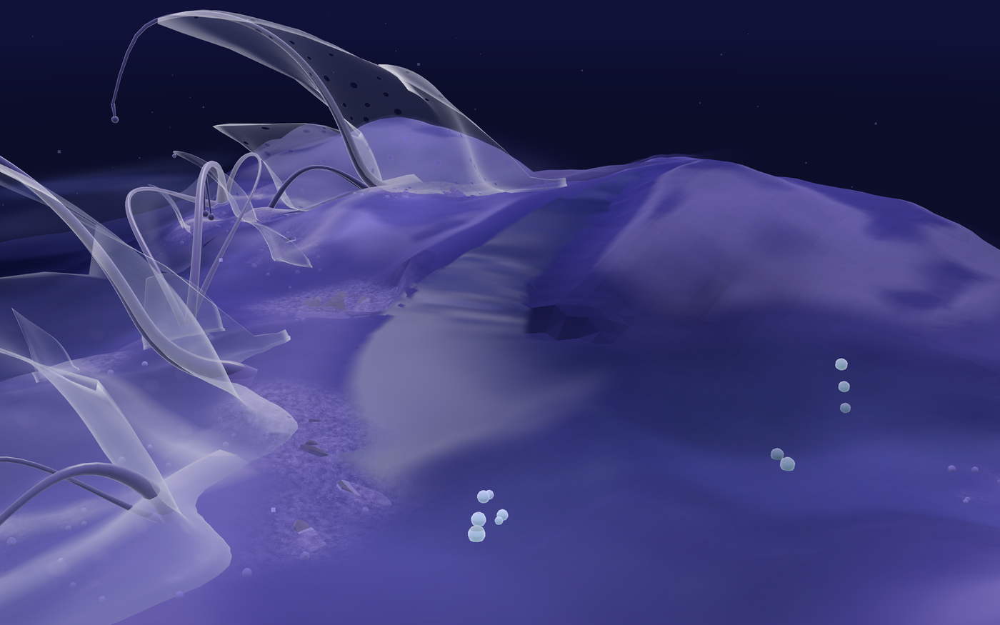
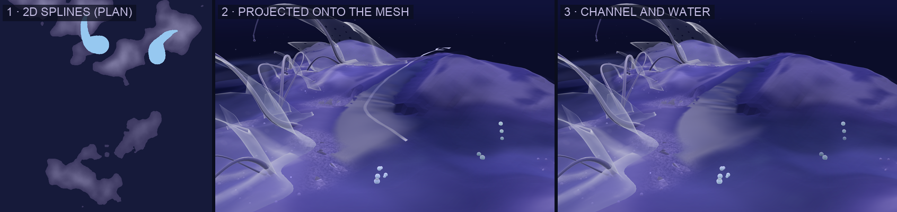
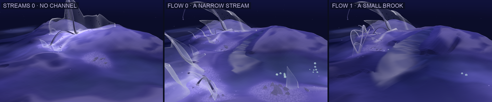
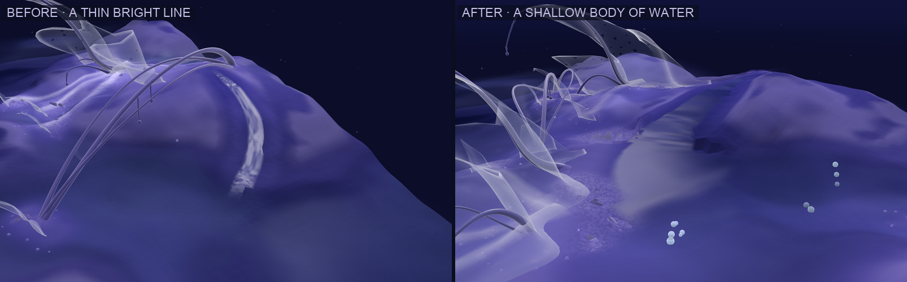
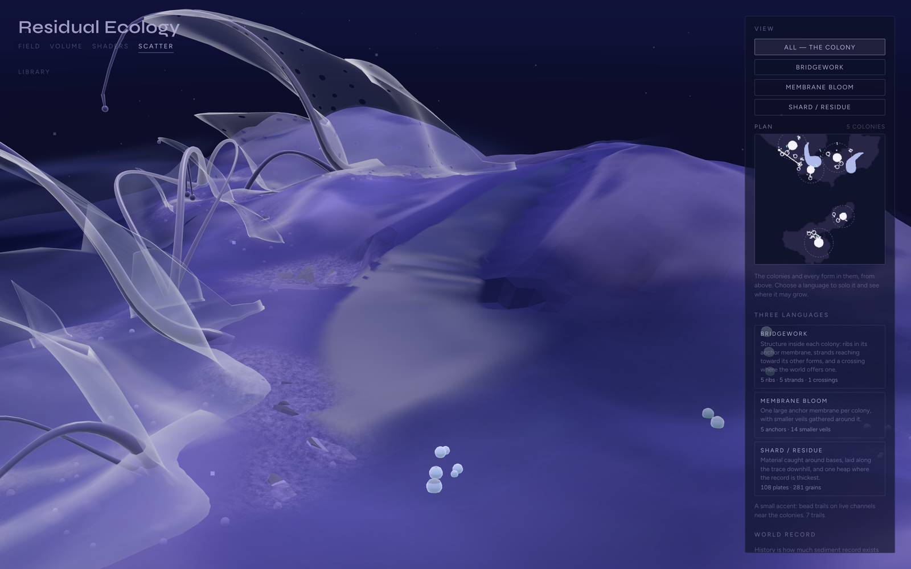
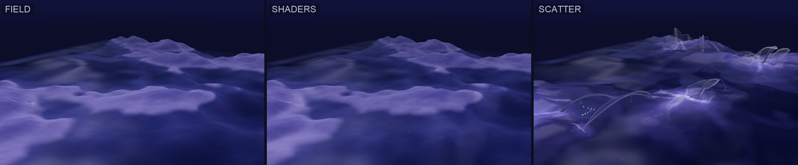
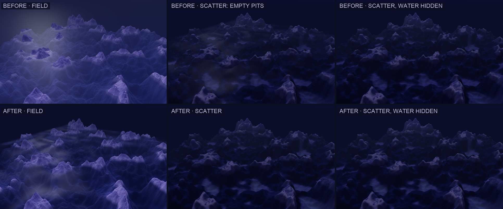

# 06 · Water veins — spline study

*Assignment 2. A stream is a spline the land draws.*

**The assignment.** Use a spline layer:
- think about what can be represented as lines
- think about how a 2D line is projected onto a 3D terrain
- think about how the spline and the mesh influence each other

**Here.** A few narrow streams — water veins — that rise on high, thick
ground and run down into the basins. They are part of the one world, not a
study of their own. Every tab shows them, in the same channels.

## In simple terms

Each stream is **one spline: its centreline.**

- **The land draws the line.** From a high point, the line walks downhill.
  It leans into hollows, keeps off ridges, wanders a little more on gentle
  ground, and stops once it reaches the water.
- **The line marks the land.** It is laid onto the terrain and shapes a broad,
  shallow channel into the ground itself, with soft banks, slightly damp, and
  a little pale material beyond them.
- **Water fills the channel.** A shallow translucent body lies in it, level
  across its width: narrow at the source, broader downstream, pooling where it
  meets the basin. Broad ripples drift down it.

## Terrain → spline

| The ground | What it does to the line |
|---|---|
| **height above the water × distance from it** | picks the sources: the high, thick ground |
| **slope** (of a broad, smoothed copy of the ground) | carries the line downhill along the large-scale form of the land; on steep ground it runs straight, on gentle ground it wanders |
| **hollows and ridges** (broad curvature) | pulls the line into hollows and off ridges |
| **the basins** | end the line: it runs a few steps into the water and stops |
| **pits above the water** | reject the line: a course that would end in a dry pit is discarded, so every stream reaches water |
| **another stream** | joins it; below the confluence the host carries more |

The walk carries momentum and is smoothed into a Catmull-Rom curve with
control points about 0.6 units apart, so the course follows broad topography
rather than every bump. On each land mass, largest first, several sources are
walked and the longest course is kept: two good streams rather than several
weak ones.

## Spline → terrain

- **Channel.** The spline shapes the world field itself, not just its
  picture, so the mesh, the water's depth, the sediment simulation and the
  colonies all stand on the stream's ground. Around the centreline the ground
  is drawn toward a soft valley section:
  - the bed is at the centre, rising as the square of the distance
  - the section blends back into the real ground over about two and a half
    widths
  - where the ground is higher it is cut; where slightly lower, a faint levee
    keeps the water in
  - under the basin it only ever cuts

  The bed follows the real ground along the stream, smoothed over about a
  unit and never rising downstream.
- **Width and depth** grow with how much the stream carries, which increases
  downstream and at confluences. The stream is narrower where steep and
  broader where gentle, and widens into a pool over its last 1.6 units before
  the basin. The channel is about 25× wider than deep: water lying in the land,
  not a cut in it.
- **Banks.** A finer grid tells every reading of the ground where it is damp
  (slightly darker and cooler) and where fine material has settled (faint pale
  patches just beyond the damp).
- **Water.** A surface level across its width, a little wider than the water
  itself. The banks rise through it, so the shoreline is drawn by the ground,
  as at the basins, and the water thins toward it by its real depth. Its
  colour is the basin water's, with reflected light carried across the whole
  width by broad ripples drifting downstream. It rides the ground exactly as
  the terrain does, so it never parts from its bed.
- **Colonies keep clear.** A colony site avoids the streams, and each stream
  claims its course, so no membrane or residue stands in the water. Structure
  may still arch over it.

On the default world: **2 streams, about 9.4 units of water**, dropping 0.76
and 0.98 units from source to basin. The water's width:

| Flow | near source | midway | at the mouth | water depth |
|---|---|---|---|---|
| 0 | 0.23 | 0.56 | 1.2–1.3 | 0.018 |
| 0.5 (default) | 0.37 | 0.93 | 2.0–2.2 | 0.030 |
| 1 | 0.53 | 1.30 | 2.8–3.1 | 0.042 |

### Scale pass

The first version of the water was right in principle and wrong in scale. At
the default it was 0.3–0.45 units wide on a landform whose forms are several
units across. Close up, it read as a glowing crack:
- its ripples were drawn at high frequency, as fine stripes
- a streak highlight ran along them
- its edges were clamped up onto the banks, where they caught the light like
  a contour line

The changes:

| | Before | Now |
|---|---|---|
| **width** | 0.3–0.45 | ≈ 0.4 at the source, ≈ 0.9 midway, ≈ 2 pooled at the mouth: 3–5× |
| **channel** | a narrow incision | a broad shallow section with soft banks, about 25× wider than deep |
| **route** | a lightly smoothed ground | a broadly smoothed ground (≈ 1.5 units) and a smoother spline; carved into the real ground afterwards |
| **water** | edges on the banks, fine stripes, streak lines | level across, shoreline drawn by the banks, broad slow ripples, no drawn edges |
| **count** | 3 by default | 2, each the longest course on its land mass |

## Controls

Two, in the Scatter panel's World record section:

| Control | What it does |
|---|---|
| **Streams** | how many rise, 0–3 (2 by default) |
| **Flow** | from a narrow stream to a small brook: the water's width and depth |

Streams belong to the world, so they take the landform's seed, not the
colony's. Adding `?debug=streams` to the URL draws each spline and its source
just above the ground. This is an internal check, not part of the interface.

## One world

**What was wrong.** The tabs had started to read as different worlds:
- **Field and Shaders** drew the raw base field. **Scatter** drew it with the
  relief added (study 05), plus its own carving.
- **Field** had its own water: an opaque plane seven times the field's size.
  **Shaders and Scatter** had a depth-aware veil, and Scatter's was the
  faintest of all.

**The change (the smallest safe one).** App now builds one world field —
**base → relief → streams carved in** — and every tab renders it with one
water surface and one misty edge. Field and Shaders now show the revised base
as well. The rest stays per tab, as it should be:
- which reading of the ground (Field ramp, Geological, Dormant, Membrane)
- which sediment record (live, or Scatter's history)

Two fixes came with it:
- **Height encoding.** The water reads ground height from an 8-bit copy of the
  field that was clipped to 0…1. The relief lifts land above 1 and deepens
  basins below 0, so the water's depth was wrong at both ends. The copy now
  spans −0.5…1.5.
- **Mesh resolution.** The default rose from 160 to 224 cells, so a stream's
  channel spans a few vertices.

Earlier figures in studies 01–05 are kept as they were captured, as history.
The live app no longer keeps their geometry differences.

## The empty pits

**Diagnosis.** On a rough, tall landform (your screenshots: landform scale
4.15, detail 20.4, elevation 5), Field showed lakes and Scatter showed dark
empty pits. Measured from the same camera:

| | Field | Scatter |
|---|---|---|
| pixels changed by the water | **70%** | **15%** |
| mean change from the water | 18 / 255 | 3.4 / 255 |
| land luminance, water hidden | 45 | 18 |

So the pits came almost entirely from the **missing water**. Scatter's veil
was set to 0.5 and then made clearer still (×0.6) for the Dormant reading,
leaving a basin a bare, dark hole. Dormant's darker ground deepened the
effect.

**The relief itself was a minor part.** On this landform it deepens basins by
about 20% (mean depth 1.09 → 1.31) and raises pit walls by about 15% (median
1.25 → 1.43). That is enough to make the holes slightly deeper, not to make
them holes.

**Now** every tab has the same water, at Scatter a little fuller than before
(0.85, clarity 0.9 in Dormant). The basins hold water in every tab, so a low
basin reads as a lake, not a hole.

## Earlier versions

This study went through three ideas before this one. They are kept as history:
1. **Floating passages** between colonies.
2. **Seams** in the ground that peeled up into strands across hollows and
   water.
3. **Seepage**: a damp shader mark with no water of its own, in a study view
   of its own.

All three made the line an object or a mark *on* the world rather than part
of it.

## Status: paused

The study is paused here, without further tuning, and work moves on to the
particle study ([07](07-air-study.md)). As of study 07 the limitations below
are **still unresolved** and the streams need later revision.

**What it demonstrates.** The Assignment 2 relationship works end to end:
- the terrain shapes the spline
- the spline is projected onto the mesh and modifies it
- the resulting stream becomes part of the shared world that every tab
  renders

The limitations below are known, and they are about how the result *reads*,
not about that relationship.

### Known limitations / future revision

1. **Water surface direction.** The surface shows obvious horizontal, banded
   ripples that do not follow the local direction of the stream. It reads like
   scan lines rather than flowing water. The ripples are laid out in the
   ribbon's own across/along coordinates, so on bends and seen at an angle they
   form regular bands.
   *Future:* move the surface along the local spline tangent (a flow
   direction per point, as in flow-map water), or replace the regular bands
   with much subtler, irregular variation.
2. **Source placement.** Sources satisfy the terrain rules computationally:
   high ground, far from the water, and a course that reaches the basin. But
   they often do not look like places where water would begin.
   *Future:* choose sources from stronger world logic, for example:
   - the land's thickness and topography (saddles, heads of hollows)
   - the catchment above a point
   - the accumulated trace and flow from the sediment history
   - a relationship to the colonies

   That is, rather than taking valid high points.
3. **Integration.** The broader, shallower channel is an improvement, but the
   stream still reads as a procedural layer placed onto the terrain, not as a
   fully integrated landform and water feature.
   *Future:* let the stream take part in the landform, for example by:
   - carving at the scale of the valley it runs in, not only its channel
   - having the sediment simulation route material along it and deposit
     at its mouth
   - letting the banks' material and the surrounding ground respond to it
     over a wider area

### Smaller notes

- **Short streams.** The islands are small, so each stream runs about 4–5
  units. No two meet on the default world, so confluences are implemented but
  not seen.
- **Both default streams are on the north island,** which the default camera
  sees from afar. With Streams at 3, a third rises on the near south island.
- **Cutting through bumps.** The route follows the broad ground. Where the real
  ground has a bump the route ignored, the channel cuts through it and leaves a
  small steep, shaded notch in the bank.
- **On rough landforms** courses are shorter, and on steep small islands the
  water overlaps the basin water near the shore.
- **No effect on sediment.** The streams shape the ground the sediment
  simulation runs on, but do not carry material themselves.

## Files

| File | Role |
|---|---|
| `react-app/src/lib/streams.js` | sources, the walk, the spline; carving the field; the bank grid; the water ribbon |
| `react-app/src/App.jsx` | the one world field (base → relief → streams) handed to every tab |
| `react-app/src/components/Terrain.jsx` | one shared water; the stream water material; banks in every reading; the wider height encoding |
| `react-app/src/lib/scatter.js` | colonies keep clear of the streams |
| `react-app/src/components/ScatterPanel.jsx` · `ScatterMap.jsx` | the two controls; the streams on the plan |
