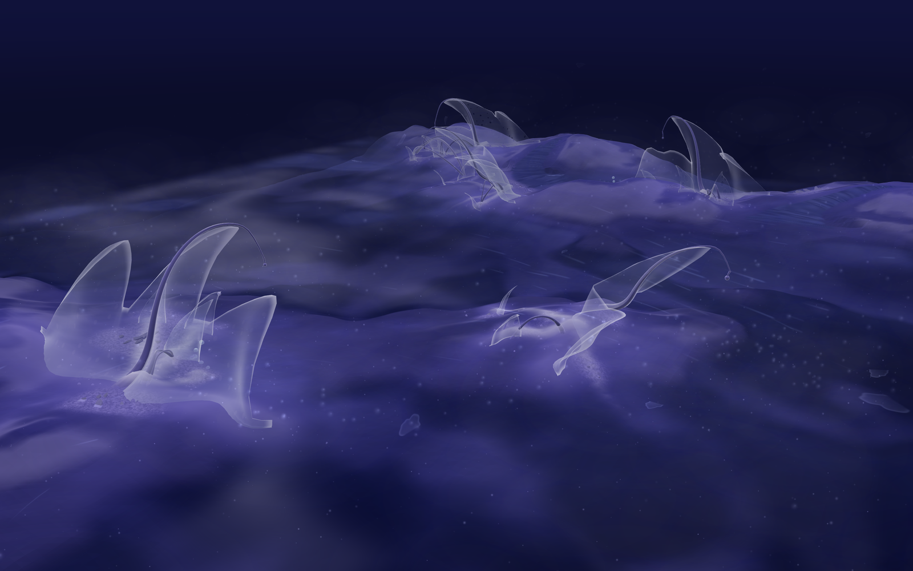
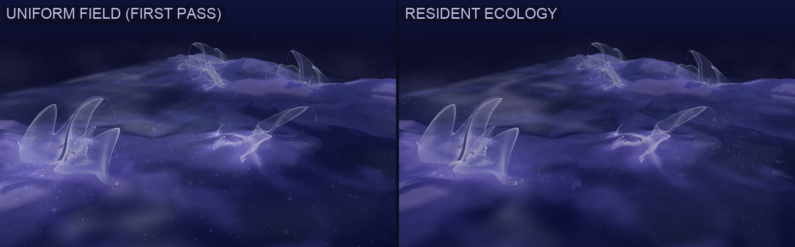
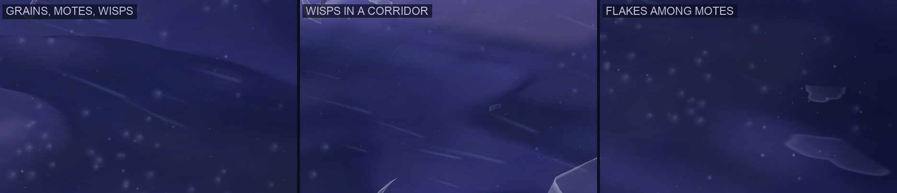
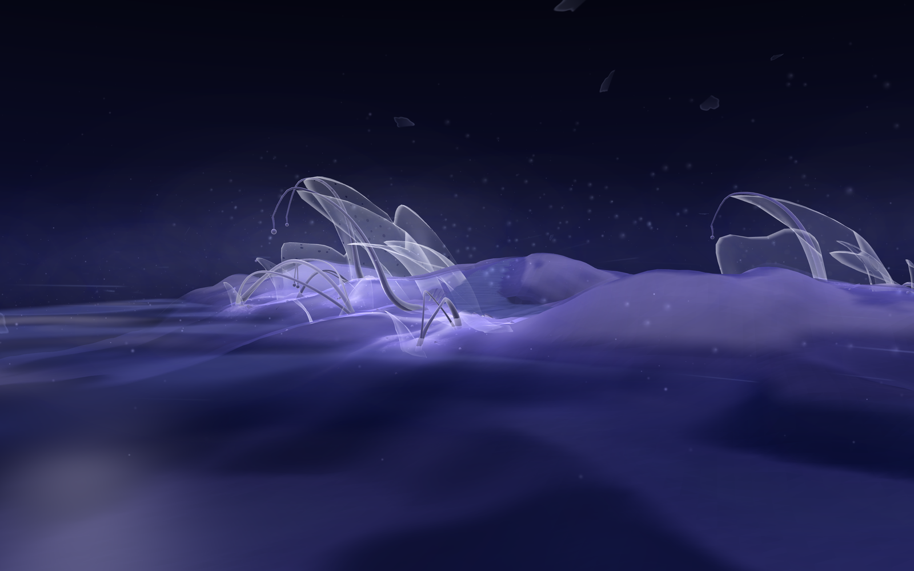
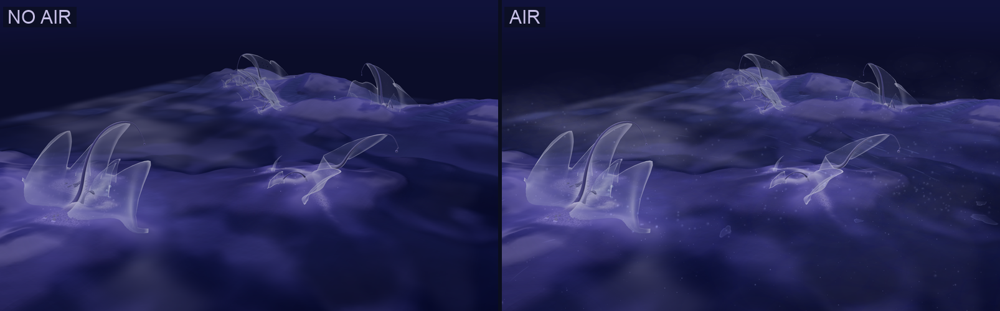
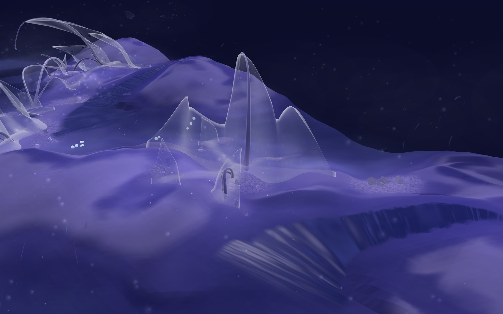
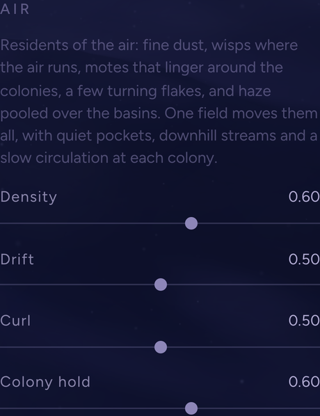

# 07 · Air — particle study

*Assignment 3. The residents of the air, moved by one field.*

**The assignment.** Add a particle layer moved by a vector field:
- particles that live in the scene's volume, not on the terrain
- a smooth 3D flow field: a slow large-scale drift, gentle curl, and the
  world's own influence on it
- the terrain and the colonies may shape the motion

**Here.** One particle system for the whole habitat, in the main scene of
every tab. It is not one kind of particle but a small **ecology**. Five
residents share the air:
- fine dust
- wisps where the air runs
- motes that linger around the colonies
- a few slowly turning membrane flakes
- haze pooled over the basins

One field moves them all, and each reads it in its own way. The field itself
is uneven: quiet pockets, streams, and a slow circulation at each colony.

## From a uniform field to a resident ecology

The first pass was a single ambient layer. Almost every particle was a
similar small round point, spread evenly through the volume, in the same
pale palette, all moving the same way. It lifted the palette, but it read as
**snow or a star field**.

Three things made it uniform:
- **The particles were all alike:** round sprites, in one size range.
- **The distribution was even, by design.** The field had no divergence, so
  matter could not gather anywhere except slightly at the colonies.
- **Far dust became little discs.** To avoid single-pixel sparkle, every
  distant grain was drawn as a soft disc a few pixels wide. Spread across the
  whole view, those discs looked like snowflakes.

This pass keeps one integrated system and the same four controls, and
changes three things:
- **who lives in the air:** five residents, each with its own form, motion,
  lifespan and place
- **how the air moves:** quiet zones, downhill streams over the land, and a
  convection cell at each colony
- **where you see it:** a depth hierarchy, with most activity in the middle
  distance, an almost empty sky, and only the odd larger resident passing
  near the camera

## The residents

| | Form | Motion | Lives | Where |
|---|---|---|---|---|
| **dust** · ~80% | very fine soft grains; most faint, a few brighter; silver and pale lavender | carried by the field | 1–2.5 min | everywhere, leaning to the quieter of two places, so it **collects in pockets** |
| **wisps** · ~10% | soft threads laid along the flow; they bend with it and swell from a fine tail; icy blue | run with the field (×1.3); held only lightly by colonies | 10–25 s | **born where the air runs fastest** (the fastest of four tries), low over the ground; seen only now and then, as a gust catches them |
| **motes** · ~6% | a little larger: a soft body with a dim seed off its centre, like a spore; lean toward aqua when held | slower (×0.8); held hardest by the colonies (×1.6) | 1.5–3.3 min | **most are born around a colony** and ride its circulation |
| **flakes** · ~0.5% | flat, irregular fragments torn along one side; mostly translucent body with a faint rim and a thin-film hue shift | drift slowly (×0.7); **turn in space**: a slow yaw, a rocking tilt, a roll in their own plane | 1.3–2.7 min | anywhere at mid height; the odd one passes near the camera, softened as if out of focus |
| **haze** · ~3.5% | broad, very faint veils, wider than tall | lag the air (×0.5) | 1–2 min | **pooled over the basins and low ground** (the lowest of three tries) |

None of them has an outline. A rim around a mote read as a bubble, a ring
around a flake as a cell, and thin straight wisps as rain. Each was reworked
until it read as matter rather than as a symbol.

## The field

One velocity field, at three scales. The residents read it with their own
gains (the multipliers in the table).

**Global: drift and curl, with quiet zones.**
- **Drift:** a slow current, mostly across the default view, whose heading
  turns over many minutes. When it ran toward the camera, every wisp
  projected as a near-vertical line and the air read as rain. Seen across,
  it reads as moving air.
- **Curl:** nine slowly travelling waves form a stream function in every
  horizontal layer, so the swirls themselves never pile matter up.
- **Quiet zones:** both drift and curl are scaled by a broad **activity map**,
  three waves 25–50 units long, that moves much more slowly than the air.
  Where it is low the air nearly stills. Matter carried in slows down and
  collects there, and the active zones between run clearer and faster.

**Terrain: downhill air, pools and hover.**
- **Downhill air:** near the ground (falling off over about a unit) the air
  slides down the slope, as cold air does at night. It converges in hollows
  into **streams** and spreads off ridges.
- **Pools:** over the basins, where the floor is flat water, the air pools
  and stills near the surface. The open water beyond the land is not
  stilled.
- **Hover:** every resident keeps its own height over the floor (the ground
  or the water's surface): wisps lowest, flakes highest.

**Colonies: slowing, drawing in, turning, circulating.** Within about 1.7×
its radius, scaled by **Colony hold** and each resident's own gain, a colony:
- **slows** the global air by up to 85%
- **draws** matter gently in
- **turns** it slowly about itself, clockwise and anticlockwise in turn from
  one colony to the next
- runs a **convection cell**: the air rises through the colony, spills
  outward above its membranes, sinks around it and is drawn back in low. The
  cell is an axisymmetric stream function, so it circulates without piling
  matter up. Motes ride it in slow loops of a minute or two.

### Measured

From a CPU run of the same field (16,000 particles, five minutes, default
settings):

| | Result |
|---|---|
| dust density in the quietest zones vs the most active | **1.77×** vs **0.67×** the mean |
| unevenness of dust over 2-unit cells (coefficient of variation) | **0.72** (pure random scatter: 0.15); 20 of 289 cells nearly empty |
| median speed: wisps vs dust | **0.17** vs **0.06** units/s |
| median height above the floor: wisps vs dust | 0.54 vs 0.84 |
| motes within 1.5× a colony's radius | **63%** (dust: 24%; the zones cover about 23% of the area) |
| haze over the basins | **61%** (dust: 34%) |

## Depth

- **Far sky:** dust thins with height over the ground and is gone beyond
  about 25 units. Wisps keep low. A particle seen against the sky is rare.
- **Middle distance (about 4–20 units):** where dust, wisps and motes are
  most readable.
- **Near the camera:** dust and wisps fade out. Motes may come a little
  closer. Flakes may pass close by, softened and dimmed as if out of focus.
- A point smaller than a pixel and a half fades rather than being drawn as a
  crisp dot, and no far point is ever enlarged into a disc.

## Palette

| Resident | Colour |
|---|---|
| ambient matter (dust, haze, flakes) | silver and pale lavender |
| the flow (wisps; a flake's rim when edge-on) | icy blue |
| around active colonies (motes, and a touch on everything held) | a restrained aqua/mint shift |

The residents are all additive, so they brighten what is behind them. On the
default view the air raises the image's mean brightness by **15%** (39.3 →
45.3 of 255) and lowers its saturation by 6%. Most of that lift comes from
the pooled haze.

## Controls

Unchanged and compact: four sliders in the Scatter panel's **Air** section.
They apply in every tab.

| Control | What it does |
|---|---|
| **Density** | how many residents the air holds (0.6 draws about 9,800 of 16,384 particles; every resident in proportion) |
| **Drift** | the slow current across the scene, and the air sliding downhill |
| **Curl** | how much the air turns and folds |
| **Colony hold** | how strongly colonies slow the air, draw it in and circulate it |

Field and Shaders have no colonies, so their air has no colony circulation,
and motes there are born anywhere.

## How it runs

- **One simulation.** All 16,384 particles live in one 128 × 128 float
  texture, stepped every frame by a GPU compute pass. Each particle's
  resident, hover height, lifespan and tone are its own constants. The
  field's GLSL is generated from the same tables as its JavaScript.
- **Drawn four ways from the same positions:**
  - dust and motes as points
  - wisps as instanced ribbons that trace back along the field in four steps
  - flakes as instanced quads oriented in 3D
  - haze as instanced veils facing the camera. These are not depth-tested;
    each fades as a whole where the land stands between it and the camera.
- **Performance:** at 3200 × 2000 in headless Chrome on this machine, 60 fps
  with the air and without it.

## Limitations

- **Pockets need time.** Quiet zones fill over a minute or two after a
  reload or a new landform, and they drift slowly with the activity map.
- **Wisps are drawn along the field, not along their own history.** Each
  thread is the path the air would have taken over the last few seconds.
  Where the field changes quickly, a wisp can swing as a whole.
- **The flakes' turning is scripted** (a slow yaw, tilt and roll per flake),
  not driven by the air around them.
- **Veils** are tested against the floor only, not the colonies.
- **Colonies are capped at six**, and their circulation is analytic: the air
  does not flow around individual membranes or leave a wake.
- **The volume wraps** at ±17 units, faded at the sides.

## Not resolved: the streams

Study 06's streams are still **paused, and they need later revision**. This
pass did not touch them. The known limitations in
[06 · Known limitations / future revision](06-passages-study.md#known-limitations--future-revision)
still stand:
- the water surface's banded ripples do not follow the stream's direction
- the sources are valid but not convincing places for water to begin
- the stream still reads as a layer placed on the terrain rather than a
  landform

The air treats the stream water like any other water: it pools over it near
the basins and slides along the land beside it.

## Files

| File | Role |
|---|---|
| `react-app/src/lib/air.js` | the residents' table; the field (global, terrain, colonies); the floor; its JavaScript and generated GLSL |
| `react-app/src/components/AmbientAir.jsx` | the GPU simulation and spawning; the four drawings (points, wisps, flakes, veils); the depth hierarchy and palette |
| `react-app/src/components/Scene.jsx` | the air in the main scene, in place of the old motes |
| `react-app/src/components/Atmosphere.jsx` | motes can be switched off |
| `react-app/src/App.jsx` · `ScatterPanel.jsx` | the four controls; the colonies handed to the air in Scatter |
